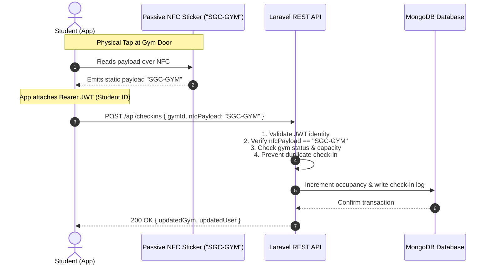

# 🏋️‍♂️ Sejong Gym Check-in App (SGC)

[](https://expo.dev/)
[](https://reactnative.dev/)
[](https://react.dev/)
[](https://expo.dev/)
[](LICENSE)

> A modern, mobile-first facility access and occupancy management system designed for **Sejong University Gymnasium** (Student Union Building B, 3F). Students can monitor real-time gym capacity, tap passive NFC entrance stickers with their smartphones to check in and out, and view their workout history.

---

## 📌 Table of Contents

- [Overview & Problem Statement](#-overview--problem-statement)
- [System Architecture & NFC Security Model](#-system-architecture--nfc-security-model)
- [Key Features](#-key-features)
- [Tech Stack](#-tech-stack)
- [Project Structure](#-project-structure)
- [Getting Started](#-getting-started)
- [Demo Credentials & Testing](#-demo-credentials--testing)
- [Backend API Contract (Planned)](#-backend-api-contract-planned)
- [Roadmap](#-roadmap)
- [License](#-license)

---

## 🎯 Overview & Problem Statement

The Sejong University Gymnasium is a popular on-campus amenity with limited physical capacity (e.g., 50 occupants). During peak academic hours, students frequently face overcrowding, long lines, or arrive only to find the facility at capacity. Traditional paper sign-in sheets are prone to inaccurate records, manual overhead, and inability to track real-time occupancy.

**Sejong Gym Check-in (SGC)** solves this with a mobile-first digital check-in platform:

- **Live Occupancy Tracking**: Students can check current gym capacity and status before leaving their dorm or classroom.
- **Frictionless NFC Tap**: Check in or out in seconds by simply tapping a passive NFC sticker placed at the gym door.
- **Privacy & Fraud Prevention**: Hardware stickers store zero student data; authentication is secured through student credentials and JWT tokens.
- **Workout History & Insights**: Students can track past visits, visit duration, weekly frequency, and check-in statuses.

---

## 🔐 System Architecture & NFC Security Model

### The Passive Sticker Model

Unlike systems that require expensive dedicated smart kiosks or cards that encode sensitive user credentials, SGC utilizes **low-cost passive NFC stickers** (NFC Forum Type 2 / NTAG series) fixed at the entrance and exit:



### Security & Privacy Highlights

1. **Zero Data on Sticker**: The passive sticker broadcasts **only** the static string `"SGC-GYM"`. It contains **no** student ID, no occupancy counts, and no database records.
2. **Authenticated Student Token**: Student identity is derived exclusively from the authenticated session (Bearer JWT) inside the mobile app.
3. **Server-Side Enforcement**: All concurrency handling, occupancy increments/decrements, opening hours checks, and double-tap prevention are validated on the backend.

---

## ✨ Key Features

- **🎓 Student Authentication**: Clean login screen with validation for 8-digit Sejong University Student IDs and password credentials.
- **📊 Real-Time Capacity Dashboard**:
  - Live occupancy gauge (e.g., `24 / 50` spots occupied).
  - Visual status badges (`Open`, `Full`, `Closed`).
  - Dynamic, color-coded capacity progress bar with real-time percentage indicators.
- **📲 Animated NFC Scanner Screen**:
  - Full-screen radar pulse animation indicating scanning state.
  - Realistic timing simulation and auto-detection handling.
  - Clear error states for wrong stickers or scan timeouts.
- **🛠️ Built-in Developer Simulation Panel (`DevPanel`)**:
  - Allows full end-to-end testing directly on simulator, physical device, or web browser without physical NFC hardware.
  - Pre-configured simulation scenarios:
    - `✓ Check-in Success` (Valid tag, checks in student and increments gym count)
    - `✓ Check-out Success` (Valid tag, checks out student and decrements gym count)
    - `✗ Invalid NFC` (Simulates unrecognized third-party NFC tags)
    - `✗ Already Checked In` (Simulates duplicate tap prevention)
    - `✗ Already Checked Out` (Simulates check-out without prior check-in)
- **📅 Session & Check-in History**:
  - View historical gym visits with dates, check-in and check-out times, and duration.
  - Filterable by user session with pull-to-refresh.
  - Status indicators: `Completed`, `In Progress`, or `No Check-out`.
- **👤 Profile & Activity Insights**:
  - Student profile information (Name, Student ID, Department, Academic Year).
  - Activity statistics: weekly session counter, total logged hours, and workout streak.
  - Notification center for capacity alerts and gym announcements.

---

## 🛠 Tech Stack

### Mobile Client (`/user`)

| Technology | Description |
| --- | --- |
| **Framework** | [React Native](https://reactnative.dev/) (v0.86.3) with [Expo](https://expo.dev/) (SDK 57) |
| **Language** | Modern JavaScript (ES6+ / JSX) |
| **Navigation** | [React Navigation 7](https://reactnavigation.org/) (Native Stack & Bottom Tabs) |
| **UI & Icons** | Vanilla React Native StyleSheet, `@expo/vector-icons` (Ionicons, MaterialCommunityIcons) |
| **Effects & Layout** | `expo-linear-gradient`, `react-native-safe-area-context`, `react-native-screens` |
| **Web Support** | `react-native-web` for browser preview and cross-platform testing |

### Backend & Infrastructure (`/backend`, Implemented)

| Component | Technology |
| --- | --- |
| **REST API** | PHP Laravel 11 REST API with JWT Authentication (`php-open-source-saver/jwt-auth`) |
| **Database** | MongoDB (occupancy transactions, student profiles, visit logs, daily summaries) |
| **Queue / Cache** | Redis via `predis/predis` (`notifications`, `analytics` queues) |
| **Push Notifications** | Firebase Cloud Messaging (FCM) via `kreait/laravel-firebase`, dispatched asynchronously |
| **Environment** | PHP 8.5 (NTS, x64) — project-local `php-conf.d` extension injection, no system php.ini edits |
| **NFC Hardware** | Passive NFC Stickers (NTAG213 / NTAG215 / NTAG216, NFC Forum Type 2) |
| **Native NFC Bridge** | `react-native-nfc-manager` (via Expo Dev Client / Prebuild) |

---

## 📁 Project Structure

```text
Sejong-Gym-Check-in-App/
├── LICENSE
├── README.md
├── backend/                          # Laravel 11 REST API (MongoDB + Redis)
│   ├── app/
│   │   ├── Http/
│   │   │   ├── Controllers/          # Auth, CheckIn, Gym, Notification, Dashboard
│   │   │   ├── Requests/             # Login / CheckIn / CheckOut request validation
│   │   │   └── ...
│   │   ├── Jobs/                     # SendFcmNotificationJob, UpdateDailySummaryJob
│   │   └── Models/                   # User, Gym, CheckIn, DailySummary, Notification
│   ├── routes/
│   │   ├── api.php                   # REST endpoints (see API Contract)
│   │   └── console.php               # sgc:seed and scheduled tasks
│   ├── php-conf.d/sgc-extensions.ini # Project-local PHP extension overrides
│   ├── composer / composer.json      # Composer LTS phar + dependency manifest
│   └── storage/app/e2e_test.php      # End-to-end HTTP contract test
├── scripts/                          # Windows PowerShell runners (non-XAMPP PHP 8.5)
│   ├── setup_new_php.ps1             # One-time: install ext-mongodb, wire extensions
│   ├── seed_db.ps1                   # Deterministic dataset seed (sgc:seed)
│   ├── start_api.ps1                 # Boot API dev server (artisan serve)
│   ├── start_workers.ps1             # Run Redis queue workers (notifications/analytics)
│   └── run_tests_e2e.ps1             # Execute the E2E HTTP contract test
└── user/                             # Student Mobile Application (Expo / React Native)
    ├── App.jsx                       # Root component with AuthProvider & AppNavigator
    ├── app.json                      # Expo application manifest & bundle configuration
    ├── babel.config.js               # Babel presets
    ├── index.js                      # Entry point registering the root component
    ├── package.json                  # Dependencies and scripts
    └── src/
        ├── theme.js                  # Centralized design system (colors, typography, spacing, shadows)
        ├── components/               # Reusable UI components
        │   ├── CapacityCard.jsx      # Gym capacity gauge and occupancy progress bar
        │   ├── DevPanel.jsx          # Collapsible NFC test scenario trigger panel
        │   ├── Header.jsx            # Top app bar with student greeting and logout
        │   ├── PrimaryButton.jsx     # Reusable action button with loading states
        │   ├── ScreenWrapper.jsx     # Safe-area and keyboard handling wrapper
        │   ├── ToastAlert.jsx        # Notification alert banners (success / error / warning)
        │   └── UserStatus.jsx        # Current student check-in badge and session duration
        ├── context/
        │   └── AuthContext.jsx       # Global authentication state, login, and user session management
        ├── data/                     # Mock fixtures and initial states
        │   ├── mockCheckInHistory.js # Sample past gym visits
        │   ├── mockGyms.js           # Sejong gym capacity, hours, and status
        │   ├── mockNotifications.js  # Announcements and alerts
        │   └── mockUsers.js          # Demo student profile
        ├── navigation/
        │   ├── AppNavigator.jsx      # Conditional stack navigator (Auth vs Authenticated tabs)
        │   └── MainTabs.jsx          # Bottom tab bar (Home, History, Profile) with dynamic insets
        ├── screens/                  # Main user interfaces
        │   ├── HomeScreen.jsx        # Gym status, primary action button, DevPanel
        │   ├── HistoryScreen.jsx     # Workout session records & status badges
        │   ├── LoginScreen.jsx       # Student ID & password form
        │   ├── NfcScanScreen.jsx     # Full-screen radar scan modal with NFC simulation
        │   └── ProfileScreen.jsx     # Student stats, streak, details, notifications
        └── services/                 # Business logic and external communication layer
            ├── mock/                 # Mock implementations mirroring future API contracts
            │   ├── _utils.js         # Async delay and formatting helpers
            │   ├── authService.js    # Student authentication and JWT generation
            │   ├── checkInService.js # Check-in/out logic, preconditions, state mutation
            │   ├── gymService.js     # Facility occupancy retrieval and state update
            │   └── notificationService.js # User notifications and read flags
            └── nfc/
                └── nfcService.js     # NFC reader interface, payload validation, mock runner
```

---

## 🚀 Getting Started

### Prerequisites

- [Node.js](https://nodejs.org/) (v18.x or v20.x recommended)
- `npm` (v9+ or v10+)
- Mobile testing options:
  - **Physical Device**: Install [Expo Go](https://expo.dev/go) from the iOS App Store or Google Play Store.
  - **iOS Simulator** (macOS with Xcode).
  - **Android Emulator** (Android Studio).
  - **Web Browser**: Supported out of the box via React Native for Web.

### 1. Clone the Repository

```bash
git clone https://github.com/nickymarzz/Sejong-Gym-Check-in-App.git
cd Sejong-Gym-Check-in-App/user
```

### 2. Install Dependencies

```bash
npm install
```

### 3. Run the Development Server

```bash
# Start the Expo development server
npm run start
```

From the terminal:

- Press `w` to open in your web browser.
- Press `i` to open in the iOS Simulator.
- Press `a` to open in the Android Emulator.
- Scan the printed QR code with your phone camera (iOS) or Expo Go app (Android).

### 4. Run the Backend API (Laravel + MongoDB)

The backend is a Laravel 11 API backed by MongoDB and Redis, with Windows PowerShell runners that do **not** require XAMPP. They target a standalone PHP 8.5 (NTS) install and fall back to `php` on `PATH` if present.

**Prerequisites**

- MongoDB on `127.0.0.1:27017` (installed as a Windows service).
- Redis on `127.0.0.1:6379` (optional — otherwise `QUEUE_CONNECTION=sync` is used).
- PHP 8.5 (NTS, x64), e.g. installed at `...\AppData\Local\Programs\PHP\current`.

**One-time environment setup**

```powershell
# Installs the matching ext-mongodb PECL DLL into the PHP ext dir and
# wires project-local `backend/php-conf.d/sgc-extensions.ini` so all
# required extensions load with no edits to the global php.ini.
powershell -ExecutionPolicy Bypass -File .\scripts\setup_new_php.ps1
```

**Seed the deterministic dataset**

```powershell
# Creates 28 users, 1 gym (gym-001), 159 check-ins, and 7 daily summaries.
powershell -ExecutionPolicy Bypass -File .\scripts\seed_db.ps1
```

**Start the API / queue workers / E2E tests**

```powershell
# Boot the API dev server on port 8000 (pass a port as an argument, e.g. 8022).
powershell -ExecutionPolicy Bypass -File .\scripts\start_api.ps1

# Run Redis queue workers for the notifications and analytics queues (optional).
powershell -ExecutionPolicy Bypass -File .\scripts\start_workers.ps1 notifications
powershell -ExecutionPolicy Bypass -File .\scripts\start_workers.ps1 analytics

# Verify the full HTTP contract against the running server.
powershell -ExecutionPolicy Bypass -File .\scripts\run_tests_e2e.ps1
```

The API is served at `http://127.0.0.1:8000` (or the port you pass) and accepts JWT-authenticated requests from the mobile app. To connect the Expo app to the backend, point the API base URL at the served port.

---

## 🔑 Demo Credentials & Testing

The app is pre-configured with demo student credentials for immediate evaluation:

| Field | Demo Value |
| --- | --- |
| **Student ID** | `20241234` (must be 8 digits) |
| **Password** | `password` (any non-empty string) |
| **Student Name** | Demo Student |
| **Department** | Department of Computer Engineering |
| **Admin ID** | `00000001` (backend only, for admin dashboard endpoints) |
| **Admin Password** | `password` |

### How to Test Check-in / Check-out

1. Sign in using the demo credentials above.
2. On the **Home** tab, tap **"Tap to Check In"** to open the animated NFC scanning radar.
3. The simulated NFC reader will scan and validate the `"SGC-GYM"` payload, automatically checking you in and incrementing the gym's live occupancy.
4. When finished, tap **"Tap to Check Out"** to end your session.
5. Expand the purple **DEV** panel on the Home screen to trigger specific edge cases (duplicate check-in, invalid sticker, etc.).

---

## 📡 Backend API Contract

The mobile client is designed with strict separation between UI screens and backend communication. The mock services in `src/services/mock/` mirror the implemented Laravel API; the backend request/response envelope is always `{ status, message, data }`. All endpoints below are served at `http://127.0.0.1:8000/api`.

### Authentication

- `POST /api/auth/login` — Body: `{ studentId, password }` → returns `{ user, token }`.
- `POST /api/auth/refresh` — Refreshes the current JWT.
- `GET /api/auth/me` — `Authorization: Bearer <token>` → current authenticated student profile.
- `POST /api/auth/logout` — `Authorization: Bearer <token>` → invalidates the current session token.

### Facility & Occupancy

- `GET /api/gyms` — List all campus gyms and their capacities.
- `GET /api/gyms/{gymId}` — Single gym details.
- `GET /api/gym/status` / `GET /api/gym/status/{gymId}` — Live occupancy count, status (`open` | `closed` | `maintenance`), and hours.

### Check-in / Check-out (NFC)

- `POST /api/checkins` — `Authorization: Bearer <token>`, Body: `{ gymId, nfcPayload }` where `nfcPayload` must equal `"SGC-GYM"`. Validates identity, capacity, opening hours, and prevents duplicate active sessions (transactional + partial unique index).
- `POST /api/checkouts` / `POST /api/checkins/checkout` — `Authorization: Bearer <token>`, Body: `{ gymId, nfcPayload }`. Ends the active session and decrements occupancy.
- `GET /api/checkins/history` — Current student's past sessions with duration and status.
- `GET /api/checkins/active` — Current student's active session, if any.

### Notifications (FCM)

- `GET /api/notifications` — Current student's notifications.
- `GET /api/notifications/unread-count` — Unread notification count.
- `POST /api/notifications/{notificationId}/read` — Mark one notification read.
- `POST /api/notifications/read-all` — Mark all notifications read.

### Admin Dashboard

- `GET /api/dashboard/gyms/{gymId}/summary/{date}` — Daily occupancy summary for a gym.
- `GET /api/dashboard/gyms/{gymId}/weekly` — Weekly occupancy summary for a gym.

> **Error handling:** unknown routes return a `404` fallback with the same envelope. A duplicate active check-in returns `409`; a check-out without a prior check-in returns `409`.

---

## 📍 Roadmap

- [x] Initial Expo React Native application prototype.
- [x] Student authentication flow and session state management.
- [x] Live gym capacity card with dynamic status indicators.
- [x] Interactive NFC scanning interface with realistic mock outcomes.
- [x] Interactive Developer Panel for scenario simulation.
- [x] Visit history and session duration logging.
- [x] Profile, workout streak, and notifications screen.
- [x] Backend development: Laravel REST API & MongoDB schema (capacity-safe NFC check-in, JWT auth, FCM, daily/weekly summaries).
- [ ] Connect production native NFC reading via `react-native-nfc-manager` (Expo Dev Client).
- [ ] Real-time WebSocket or Server-Sent Events (SSE) for instantaneous occupancy updates across all student devices.
- [ ] Administrator web dashboard for gym staff to monitor capacity and override limits.

---

## 📄 License

This project is licensed under the terms of the [MIT License](LICENSE).
